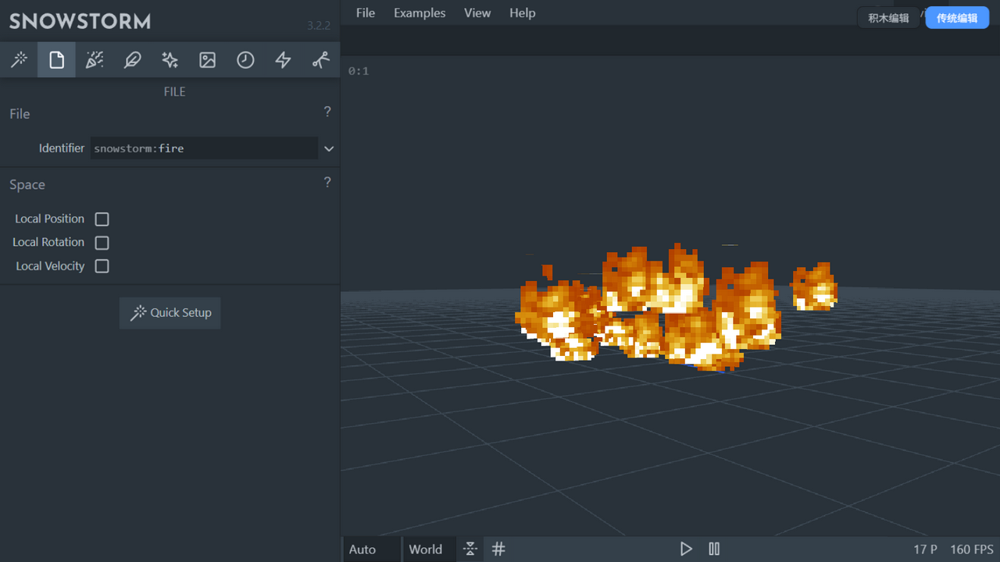

# Snowstorm 积木粒子编辑器

**在线演示：[zhongend.github.io/snowstorm](https://zhongend.github.io/snowstorm/)**（打开即默认积木模式，无需安装）

这是一个 Minecraft **基岩版粒子效果**的可视化编辑器。项目基于 [Snowstorm](https://snowstorm.app/)（原作者 JannisX11）二次开发：在完整保留原版编辑能力的基础上，新增了 **Scratch / TurboWarp 风格的积木式图形编程模式**——像拼积木一样"拼"出粒子效果，右侧 3D 预览实时变化，导出的 JSON 可以直接放进 Minecraft 资源包使用。


## 适合谁用

- 🎮 **资源包作者**：想给作品加自定义粒子（烟花、天气、技能特效），但记不住 Molang 语法
- 🧑‍🎓 **新手玩家**：完全不会编程，但想体验"拖积木做特效"的乐趣
- 👨‍💻 **进阶创作者**：需要快速试验 Molang 表达式与参数组合，看预览即时反馈

## 两种编辑模式

| | 积木模式（默认） | 传统模式 |
| --- | --- | --- |
| 操作方式 | 拖拽积木、拼接表达式 | 原版表单/文本框 |
| Molang | 用积木拼出表达式 | 手写 Molang 代码 |
| 适用场景 | 学习、直观搭建 | 精细微调、老用户习惯 |
| 数据 | **两种模式操作同一份数据，随时切换，永不丢失** | |



## 积木分类一览

| 分类 | 能做什么 |
| --- | --- |
| 🟦 粒子控制 | 粒子效果根积木（标识符），所有模块都挂在它下面 |
| 🟦 发射器 | 稳定/瞬时/手动三种发射模式，速率、最大粒子数、循环/单次/表达式寿命 |
| 🟩 发射形状 | 点、球体、立方体、圆盘、实体包围盒，支持"仅表面生成" |
| 🟧 运动 | 动态（方向/初速度/加速度/阻力）与参数化（用表达式直接控制位置方向） |
| 🟧 旋转 | 动态（初始角度/转速/加速度/阻力）与参数化（表达式直接控制角度） |
| 🟪 外观 | 粒子尺寸、四种材质混合模式、11 种摄像头朝向、环境光照 |
| 🟪 颜色 | 固定颜色、最多 8 个色标的渐变、RGBA 表达式逐粒子变色 |
| 🟫 材质/UV | 静态/全图/逐帧动画，UV 偏移、步进、帧率、循环 |
| ⬜ 碰撞 | 与方块碰撞：碰撞箱半径、阻力、弹性、碰撞后消失（删除积木=关闭碰撞） |
| ⬜ 粒子空间 | 相对位置/旋转/速度的实体空间模拟开关 |
| 🟠 Molang 区 | 13 个官方粒子/发射器变量、13 个运算符、43 个官方数学与缓动函数 |

## Molang 表达式积木化（本项目的灵魂）

不用背语法，拖积木即可拼出官方 Molang 表达式。例如"粒子旋转速度 = sin(粒子年龄 × 90)"：

```
[旋转]
   旋转速度 ← [正弦 sin]
                 └─ [×]
                    ├─ [粒子年龄]
                    └─ [90]
```

- 全部函数/变量来自微软官方文档，经数据注册表自动生成积木，中文名显示、底层输出标准 Molang
- `sin(粒子年龄×90)` 这类表达式编译后就是 `math.sin((variable.particle_age*90))`，可与手写 Molang 混用
- 无法用积木表达的复杂语句会自动放入"原始 Molang"积木，**任何数据都不会丢失**

## 快速上手

1. 打开[在线演示](https://zhongend.github.io/snowstorm/)，从左侧分类拖 [发射器]、[运动] 等积木，接到 [粒子效果] 下方的竖槽
2. 点击积木上的圆圈数字直接改值；想加动画就把 [粒子年龄]、[正弦] 拖进数字槽
3. 顶栏：**▶运行** 重播 | **⬇导出JSON** 下载粒子文件 | **📂导入材质** 换贴图 | **📃加载示例** 一键看官方示例（火焰/雪/雨等 8 种）
4. 导出的 JSON 放进资源包 `particles/` 文件夹，用 `/particle 命名空间:效果名` 命令即可在游戏中召唤

## 本地运行

```bash
npm install          # 安装依赖（需要 Node.js）
npm run dev          # 开发模式，localhost:3000
npm run production   # 生产构建，产物在 dist/
```

也可以直接用任意静态服务器托管仓库根目录（构建产物 `dist/` 已随仓库提供）。

## 技术架构（给想参与开发的你）

```
积木模式 (Blockly Workspace)
      ↓ BlockCompiler（校验通过才写入）
  Snowstorm Config（单一数据源，Wintersky 实例）
      ↑ BlockDecompiler（Config → 积木，Molang AST 解析）
传统模式 (input.js 表单) ──┐
                          ↓
      Emitter → 原版 three.js 3D 预览（每帧实时读取 Config）
```

- 新增代码全部集中在 `src/block_editor/`（积木定义 / 编译器 / 反编译器 / Molang 注册表 / 主题 / 同步器），对原版文件的改动仅 `App.vue` 模式切换与 `import.js` 一处导出
- Molang 解析器支持数字/变量/一元二元运算/比较/逻辑/三元条件/函数调用，解析失败自动回退到 Raw 积木

## 更新日志

- **v1.0** 积木编辑器发布：Blockly 工作区 + 11 类模块积木 + Molang 积木化 + 双向同步 + 图标资源自托管修复

## 许可与致谢

原项目 [JannisX11/snowstorm](https://github.com/JannisX11/snowstorm) 遵循 GPL-3.0 协议，本 Fork 同样以 GPL-3.0 开源。感谢原作者的出色工作，Minecraft/Mojang 与本项目无关。

---

(以下为原项目 README)


**在线演示：[zhongend.github.io/snowstorm](https://zhongend.github.io/snowstorm/)**（打开即默认积木模式）

在 [Snowstorm](https://snowstorm.app/)（JannisX11 开发的 Minecraft 基岩版粒子编辑器）基础上，新增了 **Scratch / TurboWarp 风格的积木式图形编程模式**：不用再对着表单填参数，像拼积木一样把发射器、运动、颜色、Molang 表达式"拼"出来，右侧 3D 预览实时变化，导出的 JSON 可直接放进 Minecraft 资源包使用。


## 新增了什么

- 🧩 **真正的积木编辑器**：基于 Google Blockly（Scratch 同款渲染风格），左侧分类 Toolbox、中间 Workspace、拖拽/吸附/嵌套/撤销/重做/复制/粘贴/缩放平移一应俱全
- 🔢 **Scratch 式数值槽**：所有参数槽带灰色 shadow 数字，点击即改；也可以把小积木拖进槽里替换
- 📐 **Molang 表达式积木化**：`sin(粒子年龄 × 90)` 不用写代码，拖 [正弦]、[粒子年龄]、[×] 三块积木拼出来；官方 43 个数学/缓动函数、13 个粒子/发射器变量、13 个运算符全部数据驱动注册
- 🔄 **双模式双向同步**：积木模式 ⇄ 传统模式随时切换，参数互通不丢失；JSON 导入导出与原版完全一致
- 🎥 **原版 3D 预览原样保留**：实时预览、材质、贴图、UV 系统零改动


## 快速上手（积木模式）

1. 从左侧分类把 [发射器]、[运动] 等积木拖进 [粒子效果] 下方的竖槽
2. 点击积木上的圆圈数字直接改值；想加动画就把 [粒子年龄]、[正弦] 积木拖进数字槽
3. 顶栏：**▶运行** 重播 | **⬇导出JSON** 保存粒子文件 | **📂导入材质** 换贴图 | **📃加载示例** 一键看官方例子
4. 导出的 JSON 放进资源包 `particles/` 文件夹即可在游戏里引用

## 本地运行

```bash
npm install     # 安装依赖
npm run dev     # 开发服务器 localhost:3000
npm run production  # 生产构建
```

## 关于本 Fork

- 原项目：[JannisX11/snowstorm](https://github.com/JannisX11/snowstorm)，遵循 GPL-3.0 开源协议，感谢原作者的出色工作
- 本 Fork 的全部改动集中在 `src/block_editor/`（约 10 个文件），对原版代码的修改控制在最小范围（`App.vue` 模式切换 + `import.js` 一处导出）

---

# Snowstorm

(以下为原项目 README)


Custom editor for Minecraft Bedrock Edition particle files. Available as a web app and VSCode Extension:
* **Web App:** [snowstorm.app](https://snowstorm.app/)
* **VSCode Extension:** [Snowstorm - Visual Studio Marketplace](https://marketplace.visualstudio.com/items?itemName=JannisX11.snowstorm)


## Interface


## Development

1. Install node and run `npm install` to install all dependencies

2. Run `npm run watch` to run the bundler and update whenever you change anything

3. Open the app

	#### Web app:

	Use your preferred local server to host the app (npx serve, xampp, etc.), and open it in your browser

	#### VS Code Extension:

	Press F5 to run the Extension Development Host in a new VS Code instance
